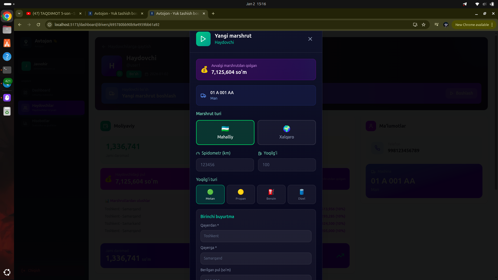

# 📱 SMS Gateway Tizimi - To'liq Qo'llanma

## 📋 Umumiy Ko'rinish

SMS Gateway tizimi Android telefon orqali SMS yuborish imkonini beradi. Bu tizim 3 qismdan iborat:

```
┌─────────────────┐     ┌─────────────────┐     ┌─────────────────┐
│   Web Panel     │────▶│   Backend API   │────▶│  Android App    │
│  (SuperAdmin)   │     │   (Node.js)     │     │  (SMS Gateway)  │
└─────────────────┘     └─────────────────┘     └─────────────────┘
        │                       │                       │
        │   SMS yuborish        │   Navbat              │   SMS jo'natish
        │   buyrug'i            │   saqlash             │   telefon orqali
        ▼                       ▼                       ▼
```

---

## 🔧 1-QISM: Backend API Sozlash

### 1.1 Kerakli fayllar

Backend da quyidagi fayllar mavjud:
- `apps/api/src/routes/sms.routes.js` - API endpointlar
- `apps/api/src/models/SmsMessage.js` - SMS xabarlar modeli
- `apps/api/src/models/SmsGateway.js` - Gateway modeli

### 1.2 API Endpointlar

| Endpoint | Method | Tavsif |
|----------|--------|--------|
| `/api/sms/send` | POST | SMS yuborish (bitta yoki ko'p) |
| `/api/sms/logs` | GET | SMS tarixini ko'rish |
| `/api/sms/stats` | GET | Statistika |
| `/api/sms/gateways` | GET | Gateway'lar ro'yxati |
| `/api/sms/gateways` | POST | Yangi gateway qo'shish |
| `/api/sms/gateway/queue` | GET | Navbatdagi SMS'lar (Android uchun) |
| `/api/sms/gateway/status` | POST | SMS statusini yangilash |
| `/api/sms/gateway/heartbeat` | POST | Gateway online ekanligini bildirish |

### 1.3 Gateway yaratish

SuperAdmin panelda "SMS Gateway" > "Gateway'lar" > "Yangi Gateway qo'shish":

```
Gateway nomi: Mening telefonim
SIM raqami: +998901234567 (ixtiyoriy)
```

Yaratilgandan keyin **TOKEN** beriladi - bu tokenni Android app'ga kiritish kerak!

---

## 📱 2-QISM: Android App O'rnatish

### 2.1 APK Yuklab Olish

APK faylni GitHub Releases dan yuklab oling yoki o'zingiz build qiling.

### 2.2 App'ni O'rnatish

1. APK faylni telefoningizga ko'chiring
2. "Noma'lum manbalardan o'rnatish" ga ruxsat bering
3. APK ni o'rnating

### 2.3 Ruxsatlar

App quyidagi ruxsatlarni so'raydi:
- ✅ **SMS yuborish** - SMS jo'natish uchun
- ✅ **Internet** - Server bilan bog'lanish uchun
- ✅ **Fonda ishlash** - Doimiy ishlashi uchun

### 2.4 App Sozlash

1. App'ni oching
2. **Server URL** kiriting: `https://avtojon.uz`
3. **Gateway Token** kiriting: (SuperAdmin paneldan olgan tokeningiz)
4. **"Ulanish"** tugmasini bosing
5. **"Xizmatni boshlash"** tugmasini bosing

### 2.5 App Holatlari

| Holat | Rang | Ma'no |
|-------|------|-------|
| 🟢 Online | Yashil | Server bilan bog'langan |
| 🔴 Offline | Qizil | Server bilan bog'lanmagan |
| 🟡 Yuborilmoqda | Sariq | SMS yuborilmoqda |

---

## 🖥️ 3-QISM: Web Panel (SuperAdmin)

### 3.1 SMS Yuborish

1. SuperAdmin panelga kiring
2. "SMS Gateway" menyusini tanlang
3. "SMS Yuborish" tabini oching

#### Bitta kishiga yuborish:
```
Telefon: +998901234567
Matn: Salom, bu test xabar
[Yuborish]
```

#### Ko'p kishiga yuborish:
1. "Userlardan tanlash" tugmasini bosing
2. Kerakli userlarni belgilang
3. Xabar matnini yozing
4. "Yuborish" tugmasini bosing

#### Barchaga yuborish:
1. Xabar matnini yozing
2. "Barchaga" tugmasini bosing

### 3.2 SMS Log'larni Ko'rish

"Log" tabida barcha yuborilgan SMS'lar ko'rinadi:
- Telefon raqam
- Xabar matni
- Status (Kutilmoqda / Yuborildi / Xato)
- Vaqt

### 3.3 Gateway Monitoring

"Gateway'lar" tabida:
- Gateway nomi va holati
- Online/Offline status
- Yuborilgan SMS'lar soni
- Oxirgi faollik vaqti

---

## 🔄 Ishlash Jarayoni

```
1. SuperAdmin SMS yuboradi
   ↓
2. Backend SMS ni bazaga saqlaydi (status: pending)
   ↓
3. Android app har 5 sekundda serverdan navbatni so'raydi
   ↓
4. Server pending SMS'larni qaytaradi
   ↓
5. Android app SMS yuboradi
   ↓
6. Android app serverga status yuboradi (sent/failed)
   ↓
7. Server bazadagi statusni yangilaydi
```

---

## ⚙️ Texnik Ma'lumotlar

### Android App Konfiguratsiyasi

```kotlin
// SmsGatewayService.kt 
private val POLL_INTERVAL = 5000L  // 5 sekund
private val HEARTBEAT_INTERVAL = 30000L  // 30 sekund
```

### Backend Konfiguratsiyasi

```javascript
// sms.routes.js
const RATE_LIMIT = {
  maxPerDay: 1000,  // Kunlik limit
  maxPerHour: 100   // Soatlik limit
}
```

### SMS Status'lari

| Status | Tavsif |
|--------|--------|
| `pending` | Navbatda kutmoqda |
| `queued` | Gateway'ga yuborildi |
| `sent` | Muvaffaqiyatli yuborildi |
| `delivered` | Yetkazildi (agar ma'lum bo'lsa) |
| `failed` | Xatolik yuz berdi |

---

## 🛠️ Muammolarni Hal Qilish

### Android App serverga ulanmayapti

1. Internet ulanishini tekshiring
2. Server URL to'g'riligini tekshiring (https:// bilan)
3. Token to'g'riligini tekshiring
4. Server ishlayotganini tekshiring

### SMS yuborilmayapti

1. SMS ruxsati berilganligini tekshiring
2. SIM karta balansini tekshiring
3. Telefon aloqa zonasida ekanligini tekshiring
4. App xizmatining ishlayotganini tekshiring

### Gateway offline ko'rinmoqda

1. Android app'ni qayta ishga tushiring
2. "Xizmatni boshlash" tugmasini bosing
3. Internet ulanishini tekshiring

---

## 📁 Fayl Strukturasi

```
apps/
├── api/
│   └── src/
│       ├── routes/
│       │   └── sms.routes.js      # SMS API
│       └── models/
│           ├── SmsMessage.js      # SMS model
│           └── SmsGateway.js      # Gateway model
│
├── web/
│   └── src/
│       └── components/
│           └── admin/
│               └── SmsPanel.jsx   # Web panel
│
└── android-sms-gateway/
    └── app/
        └── src/
            └── main/
                └── java/
                    └── uz/avtojon/smsgateway/
                        ├── MainActivity.kt       # Asosiy UI
                        ├── SmsGatewayService.kt  # Background service
                        └── BootReceiver.kt       # Auto-start
```

---

## 🔐 Xavfsizlik

1. **Token** - Har bir gateway uchun unikal token
2. **HTTPS** - Barcha so'rovlar shifrlangan
3. **Rate Limiting** - Kunlik/soatlik limitlar
4. **IP Filtering** - (Ixtiyoriy) Faqat ma'lum IP'lardan ruxsat

---

## 📞 Yordam

Muammo bo'lsa:
- Telegram: @avtojon_support
- Email: support@avtojon.uz
